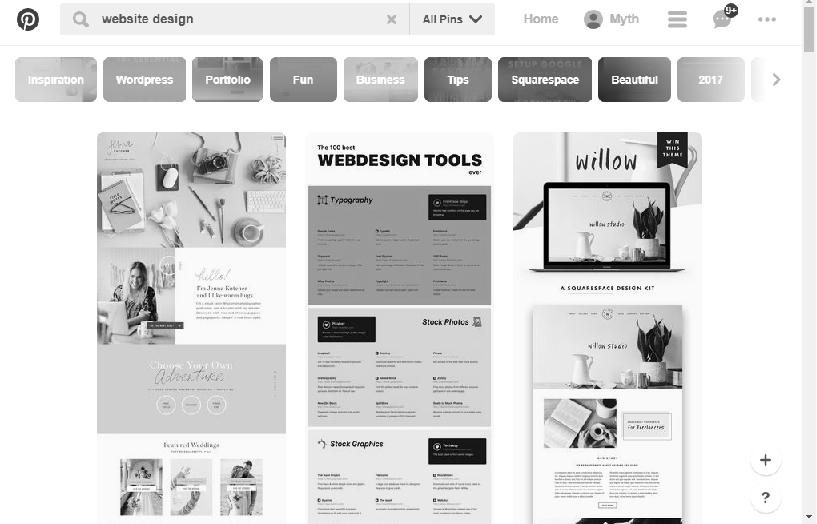

#H1 PINTEREST
***

##H2 UX
 * Hacer que el ususario pueda guardar o descargar las publicaciones que le gustan (creando pins).
 * sugerir al usuario publicaciones relacionadas a su búsqueda.
 * permitir al usuario ver información sobre publicaciones de otros usuarios.
 * informar al usuario si otros ususarios compartieron o estan compartieron las publicaciones que hizo.

##H2 IX
* Diseño de los botones *save*, *descargar*, etc.
* forma, tamaño y colores de las letras.
* diseño de la posición de las publicaciones.
* efectos hover en las imágenes.
